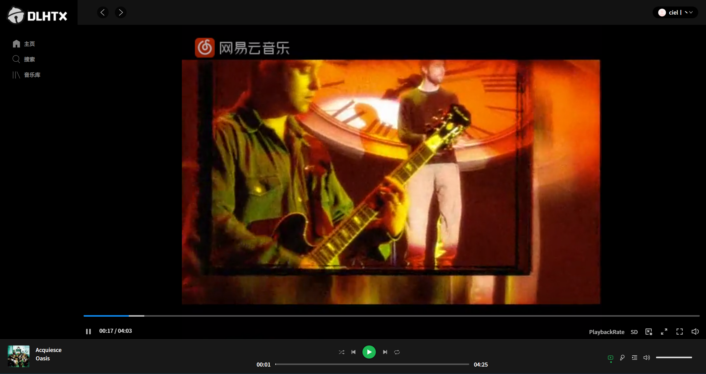

# React Netease Music
React Spotify Netease——一个基于React、TypeScript的高仿Spotify的播放器但是使用的是网易云音乐的接口哦。

最近在学习React，看到有一个高仿的网易云音乐，于是就想写一个漂亮的高仿的Spotify,代码中的技术栈主要是，希望你可以通过这个项目学习到一些React的知识


## 项目体验地址
由于项目是部署于家中的NAS所以地址可能会不稳定，你可以自己在服务器中部署，来学习和体验这个项目
后端是docker `binaryify/netease_cloud_music_api`
[高仿Spotify播放器]()

## 功能列表
- [x] 登录/登出（目前仅支持手机密码登录）
- [x] 主页
  - [x] 热门推荐歌单
  - [x] 推荐华语音乐
- [x] 全部歌单页
- [x] 歌单详情页
  - [x] 收藏歌单加动效使用lottie动画实现
  - [x] 点击播放歌单 banner滚动还原
- [x] 搜索页
  - [x] 默认推荐歌单
  - [x] 搜索艺人
  - [x] 搜索单曲
  - [x] 点击播放单曲
  - [x] 搜索建议
  - [x] 搜索结果页
- [x] 音乐播放功能
  - [x] 播放列表
  - [x] 单曲循环/随机播放
  - [x] 切换歌曲
  - [x] 拖拽进度条和音量条
  - [x] 歌词滚动/点击歌词跳转
  - [x] MV页面(无MV播放栏不显示图标) 点击自动暂停音乐自动切换其他MV
- [x] 音乐库（需要登录）
  - [x] 创建的歌单列表
  - [x] 收藏的歌单列表

注意：部分歌曲可能由于版权问题无法播放喔。

## 技术栈
- React
- TypeScript
- Antd
- CSS Modules/postcss-nested/classnames/tailwind css
- mobx (用于状态管理)
- api/axios
- 常用helpers
- react-router-dom
- alias别名 ~styles指向src/styles

## 播放器截图





## 项目启动
```
npm i 
npm run start
```
- 最后在浏览器中访问：`http://localhost:3000`

## 参考
项目中的灵感来自下面的项目
- [react-netease-music](https://github.com/uniquemo/react-netease-music)
- [NeteaseCloudMusicApi](https://binaryify.github.io/NeteaseCloudMusicApi)
